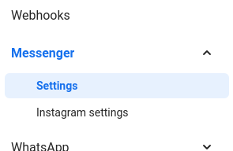
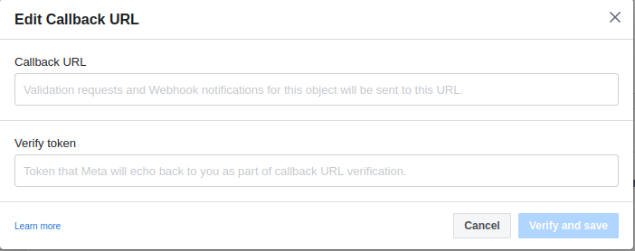

# sarufi-messenger-blueprint

Starter code to integrating sarufi chatbot with Facebook messenger. In the blueprint, we need to set up a webhook to receive new messages. This can be done in many ways but we shall go through two ways namely [ngrok](https://ngrok.com) and [replit](https://replit.com).

## Messenger set-up

To get started using this blueprint, you will need credentials which you can get from [Facebook Developer Portal](https://developers.facebook.com/) after creating an app. Note that the bot will be used on a page so you will need to create a page.

Here are steps to follow for you to get started:

- [Go to your apps](https://developers.facebook.com/apps)
- [create an app](https://developers.facebook.com/apps/create/)
- On `Which use case do you want to add to your app?`, select **Other** >> Next
- Select Business >> Business
- It will prompt you to enter basic app informations
- It will ask you to add products to your app. Add Messenger
- Create a page if you have none as the bot will be used on the page
- Get `access token`.

## Deloying the bot

### Using ngrok

Steps

1. Make sure you have [ngrok](https://ngrok.com) installed in your machine.
2. Make Project folder.

    Lets Make a project folder named `messenger-bot`. Navigate into it to create virtual evironment `messsenger-bot-env`. Activate the environment.

    Run the command to make the magic happen

    ```bash
    mkdir messenger-bot
    cd messenger-bot
    python3 -m venv messenger-bot-env
    source  messenger-bot-env/bin/activate
    ```

3. Clone the repo

    ```bash
    git clone https://github.com/Neurotech-HQ/sarufi-messenger-blueprint.git
    ```

4. Install requirements.

    Make sure you are in activated environment, then run the following

    ```bash
    cd sarufi-messenger-blueprint
    pip3 install -r requiremnts.txt
    ```

5. Create .env file

    We are going to keep our credentials in `.env` file. You can use either a text editor or command line to creat it.

    In the file, we are going to add the following

    |Key | Description|
    |---| ---|
    |saruf_api_key| Your sarufi API key|
    |page_access_token| Your facebook page token|
    |sarufi_bot_id| Id of bot to be deployed|

6. Run main.py and set ngrok

    - Fire up your python script
  
        ```bash
        python3 main.py
        ```

    - Start ngrok

        ```bash
        ./ngrok http 5000
        ```

    **`Note:`** Keep the port number the same as used in `main.py`.

7. Setting webhook

    After starting ngrok, you will have a public url to access the local server. The url looks like `https://xxxxxxxxxxx.ngrok.io`. Navigate into your facebook developer account. On the webhooks section, click `messenger` >> `settings`.

    

    Scroll down to webhook section of messenger, click `Add callback url`. Then paste the provided url into url section. Copy the `VERIFY_TOKEN`, paste it into verify token in messenger >> **Verify and save**.

    

8. webhook field subscription

    We have to subscribe to webhook fields in order to receive messages sent by user. We shall subscribe to message and postback topic.

9. Test your bot

    Open your messenger app/web, search for your page name. Send messages to it. The messages will be redirected to your bot. Here is the sample of our pizza bot deployed.

### Using replit


## Issues

If you will face any issue, please raise one so as we can fix it as soon as possible

## Contribution

If there is something you would like to contribute, from typos to code to documentation, feel free to do so, `JUST FORK IT`.

## Credits

All the credits to

1. [kalebu](https://github.com/Kalebu/)
2. [Jovine](https://github.com/jovyinny/)
3. All other contributors